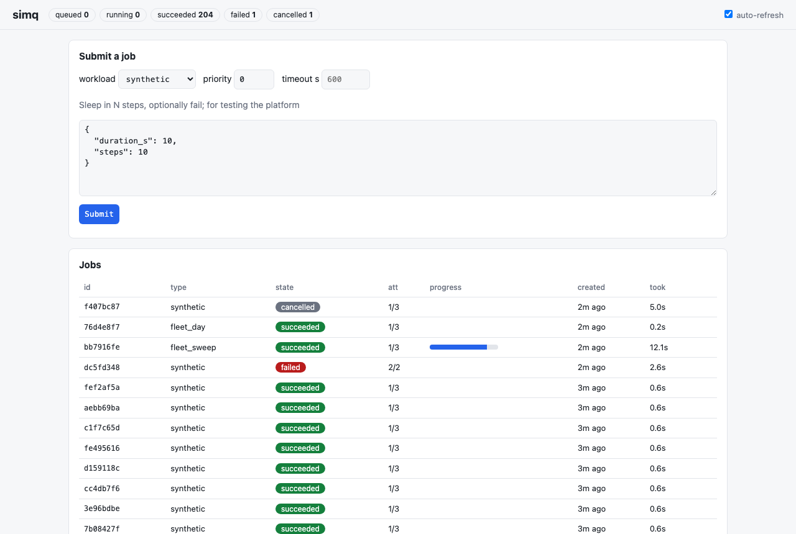

# simq

[](https://github.com/chenggma/simq/actions/workflows/ci.yml)

Job orchestration for long-running simulation workloads: a FastAPI control
plane, a Postgres `FOR UPDATE SKIP LOCKED` queue, and lease-based workers
that run each job in a supervised subprocess — with retries, hard
timeouts, cancellation, live progress, per-job logs, Prometheus metrics
and a no-build-step web UI.

The workload is real: workers run the
[fleet-day-sim](https://github.com/chenggma/fleet-day-sim) EV-drayage
simulator (single days, or parameter sweeps of hundreds of runs per job).
A synthetic workload with failure/duration knobs exists for tests and
load tests.



## Quickstart

```bash
docker compose up -d --build --scale worker=2
```

Submit a simulation through the API:

```bash
curl -X POST localhost:8000/api/jobs -H 'content-type: application/json' \
  -d '{"type": "fleet_day", "params": {"n_ev": 20, "overrides": {"battery_kwh": 500}}}'
```

or a 300-run parameter sweep with live progress:

```bash
curl -X POST localhost:8000/api/jobs -H 'content-type: application/json' \
  -d '{"type": "fleet_sweep", "params": {"param": "mass_kg", "lo": 25000, "hi": 36000, "steps": 300}}'
```

then watch it at [http://localhost:8000](http://localhost:8000) — or poll
`GET /api/jobs/{id}`, tail `GET /api/jobs/{id}/log`, cancel with
`POST /api/jobs/{id}/cancel`.

## What the platform guarantees

| property | mechanism | proven by |
|---|---|---|
| a job is never claimed twice | `FOR UPDATE SKIP LOCKED` claim transaction | racing-threads test; 200/200 exactly-once in load test |
| a dead worker's job is recovered | lease + heartbeat + reaper | worker-kill tests |
| a stuck workload cannot hold a worker forever | subprocess + SIGTERM→SIGKILL wall-clock timeout | timeout test (30s job, 1s limit, prompt kill) |
| failures retry with backoff, then park as `failed` | exponential backoff, `max_attempts` | retry tests |
| cancellation reaches running jobs | `cancel_requested` flag checked at each heartbeat | cancel test |
| worker shutdown loses no work | SIGTERM → release job, attempt un-counted | graceful-shutdown test |
| duplicate submits collapse | `Idempotency-Key` + partial unique index | API test |
| bad params never reach a worker | per-workload `validate()` at submit → 422 | API tests |
| every transition is auditable | append-only `job_events` | rendered as a timeline in the UI |

48 tests run against a real Postgres in CI, plus a compose smoke test
that builds the images, boots the full stack and pushes a synthetic job
and a real `fleet_day` job through it.

## Design

Postgres as the queue (not Redis/Celery), subprocess-per-attempt (not
in-process execution), leases (not connection-held locks), autocommit +
explicit transactions, sync endpoints, submit-time validation — each
choice is a short ADR in [docs/DECISIONS.md](docs/DECISIONS.md), with the
architecture and job lifecycle in
[docs/ARCHITECTURE.md](docs/ARCHITECTURE.md).

```
FastAPI control plane ──▶ Postgres (jobs + events + SKIP LOCKED claims)
        │                        ▲
     static UI          claim/heartbeat/finalize
        │                        │
   /metrics ◀── workers (1..N, one supervised subprocess each)
                         └──▶ shared artifacts volume (log/result/progress)
```

## Numbers (local, M-series laptop, 4 workers)

From [docs/loadtest.md](docs/loadtest.md): 200-job burst — submit
throughput **661 jobs/s** (P95 latency 64ms), all 200 executed
exactly once, ~0.12s platform overhead per attempt on top of job
runtime. Reproduce with `python scripts/loadtest.py`.

## Local development

```bash
python -m venv .venv && .venv/bin/pip install -e ".[dev,fleet]"
# any Postgres works; tests default to 127.0.0.1:54329/simq_test
SIMQ_TEST_DATABASE_URL=postgresql://user@host/db .venv/bin/pytest
.venv/bin/uvicorn simq.api:app &      # control plane + UI
.venv/bin/simq-worker                  # as many as you like
```

Ops knobs and deployment recipes (Fly.io/Railway/VM):
[docs/DEPLOY.md](docs/DEPLOY.md).

## Adding a workload

One file in `simq/workloads/`: implement `validate(params)` and
`run(params, progress)`, call `register(...)`. The API, UI presets,
retries, timeouts and artifacts come for free. See
[`fleet_sweep.py`](simq/workloads/fleet_sweep.py) for the pattern.

## Related repos

* [fleet-day-sim](https://github.com/chenggma/fleet-day-sim) — the
  discrete-event EV fleet simulator this platform runs
* [corridor-twin](https://github.com/chenggma/corridor-twin) — SUMO
  microsimulation twin of I-710 (the kind of hours-long workload the
  timeout/lease design is sized for)

## License

MIT
